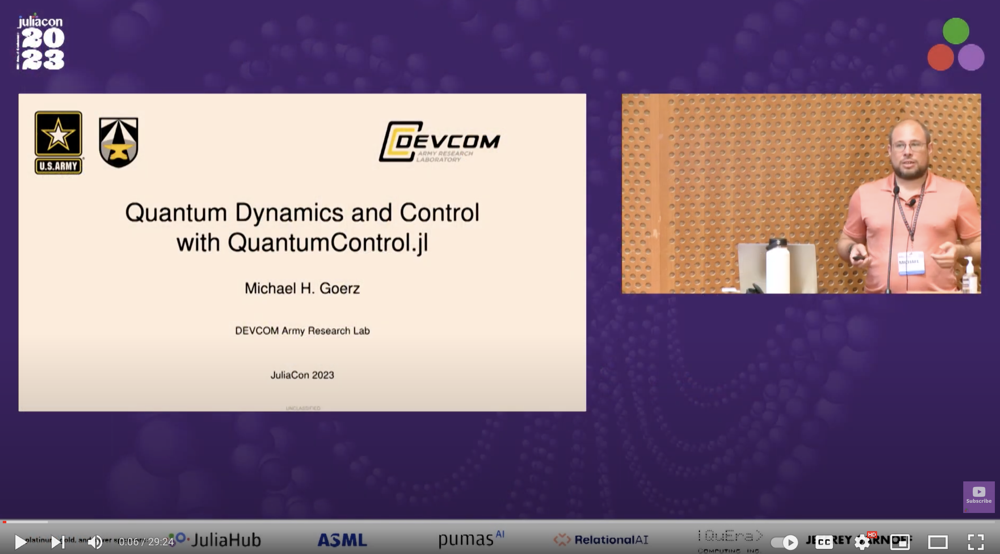

# Quantum Dynamics and Control with QuantumControl.jl

[Talk](https://michaelgoerz.net/#GoerzJuliaCon2023Talk) presented at [JuliaCon 2023](https://juliacon.org/2023/)

On [YouTube](https://www.youtube.com/watch?v=GgA8qPGifJ8):

The example shown in the talk is available at https://github.com/JuliaQuantumControl/JuliaCon2023-Demo.

## Compilation

Run `make` in a checkout of this repository to produce [slides.pdf](https://github.com/JuliaQuantumControl/JuliaCon2023-Slides/releases/download/presentation/juliacon2023_slides.pdf).
